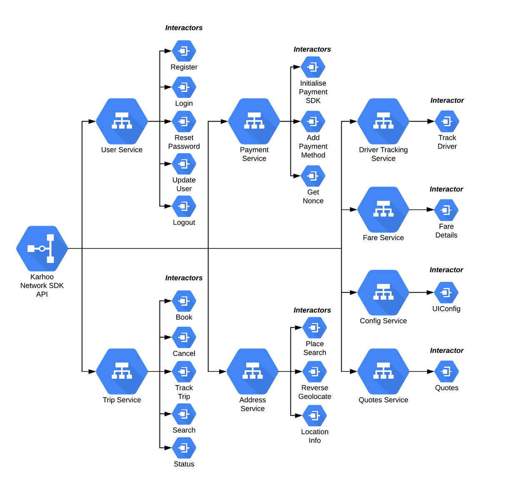

# Network SDK

 

Welcome to the Karhoo Network SDK of Android.

#Karhoo Android Network SDK

For more general information about the SDKs, checkout [**the karhoo developer portal**](https://developer.karhoo.com/docs/introduction-to-network-sdk)

## Introduction

The Network SDK provides us with a way of contacting the API of Karhoo and allows us to send and recieve network calls and responses. It is also what provides the Analytics for the App so we know what failures are occuring, how many bookings we have, what requests are succesful and more.

All the quotes, fares, profile information, etc comes through here and is passed on down to the app using it. One of the ways for using this SDK is by following our setup guide found on the Developer site.

This Networking layer is separated from the UI layer in order for consumers of the NSDK to integrate at a faster pace due to there being no need for them to create their own full networking stack.

## Architecture

The base of the Networking SDK is around a service / interactor model. Here we have a single point of entry into the SDK known as KarhooAPI. From here all of the services are accessable with the related interactors. 

Each SDK endpoint has its own interactor. These are responsible for fetching data and validating requests which may be null or bad. There is also some examples where the Interactor itself manages the data as is responsible for the mapping of multiple endpoints. A good example of this can be seen in the Quotes Interactor.

test
